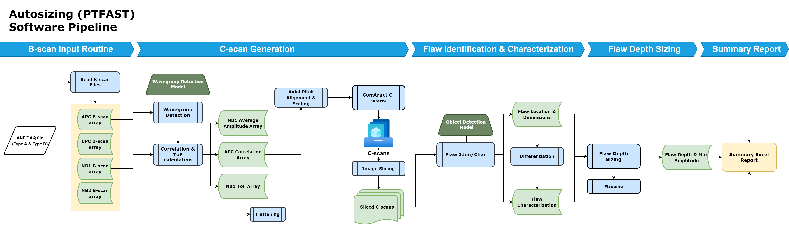

# PTFAST V1.1.0 (Autosizing)

## Release Notes for PTFAST v1.1.0
### What’s New
#### Enhanced Merging Capabilities
- Flaws Merging at 0 Degree: added capabilities for merging flaws at 0 degrees.
#### Improved Debris Flagging
- Handling New Channels and Outages: The update includes new handling capabilities for channels and outages in debris flagging models.
#### Updates
- TensorFlow Version Update: We have updated TensorFlow from version 2.7.0 to 2.10.0.

## Software Environment Setup Instructions
1. Install Python 3.9.10
    - Download and run [Python 3.9.10](https://www.python.org/downloads/release/python-3910/) (internet connection is required)
    - Ensure the "Add Python 3.9 to PATH" checkmark is checked
    - Press "Install Now"
    - Once installation finishes, select "Disable path length limit" on proceeding pop-up
2. Install pipenv
   - Navigate to code base root directory in file explorer
   - In the address bar of windows explorer, type `cmd`. This will open up a command prompt in the projects root directory
   - Enter the command `pip install pipenv`
3. Install Python Dependencies
    - Navigate to code base root directory in file explorer
    - In the address bar of windows explorer, type `cmd`. This will open up a command prompt in the projects root directory
    - Enter the command `pipenv install`
      - If you run into issues installing the pipenv virtual envirionment, see the section [Pipenv Installation Troubleshooting](#pipenv-installation-troubleshooting).
4. Activate pipenv environment
    - Navigate to code base root directory in file explorer
    - In the address bar of windows explorer, type `cmd`. This will open up a command prompt in the projects root directory
    - Enter the command `pipenv shell`, this will activate the software environment
    - Keep the command prompt open to run the software in subsequent steps

## CUDA and cuDNN Setup Instructions
1. Install CUDA Toolkit 11.2
    - Download and install from the NVIDIA CUDA Toolkit website (https://developer.nvidia.com/cuda-11.2.0-download-archive). 
2. Install cuDNN v8.1
    - Download cuDNN v8.1 for CUDA 11.2 from the cuDNN Archive (https://developer.nvidia.com/rdp/cudnn-archive). 
    - Extract and copy cuDNN files to your CUDA Toolkit directory:
    - bin\*.dll → C:\Program Files\NVIDIA GPU Computing Toolkit\CUDA\v11.2\bin
    - include\*.h → C:\Program Files\NVIDIA GPU Computing Toolkit\CUDA\v11.2\include
    - lib\x64\*.lib → C:\Program Files\NVIDIA GPU Computing Toolkit\CUDA\v11.2\lib\x64
3. Configure Environment Variables
    - Add CUDA paths to the PATH environment variable:
    - Example: Add C:\Program Files\NVIDIA GPU Computing Toolkit\CUDA\v11.2\bin and C:\Program Files\NVIDIA GPU Computing Toolkit\CUDA\v11.2\libnvvp to PATH.
4. Verify Installation
    - Run below lines of code in an activated environment to test if TensorFlow recognizes your GPU.
    `import tensorflow as tf` & 
    `print("Num GPUs Available: ", len(tf.config.list_physical_devices('GPU')))`

## Running PTFAST V1.0
### Preparing the Scan List
1. Multiple Scans: Create a `<scan_list>`.txt file (e.g., `file_paths.txt`) and list the file paths of the scans you want to process.
2. Single Scan: If processing a single scan, you will use the `--scan` option with the file path.
### Running the Software
1. Multiple Scans:
    - Execute the command: `python run_ptfast.py <scan_list>.txt --run_name <run_name>`.
    - Example: `python run_ptfast.py file_paths.txt --run_name run1`.
2. Single Scan:
    - Use: `python run_ptfast.py --scan "<path_to_file>" --run_name <run_name>`.
    - Example: `python run_ptfast.py --scan "C:\scans\scan1.anf" --run_name run1`.
### Specifying Axial Range:
1. For large scans, you can define an axial range (in mm) with `--axial_range`.
    - This option is only available for single scans.
    - Syntax: `--axial_range <start>-<end>`.
    - Example: `python run_ptfast.py --scan "C:\scans\scan1.txt" --axial_range 7000-7150 --run_name validation_run`.
    - This analyzes only the specified range of the scan.

- Remember to replace `<scan_list>`, `<run_name>`, and `<path_to_file>` with your specific file names and paths.

