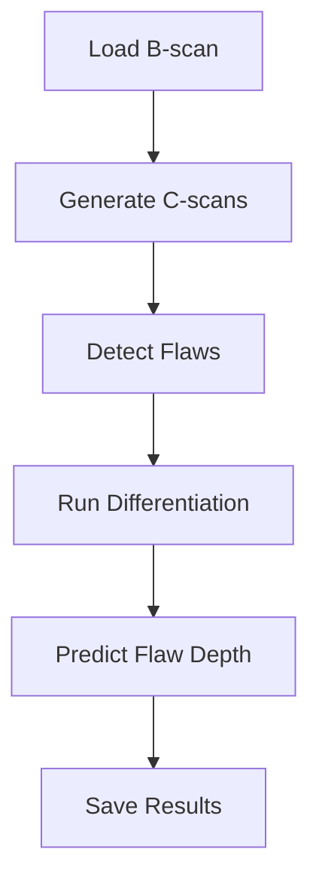

# PTFAST - Ultrasonic Testing Analysis Pipeline - Programmer's Guide

## Overview

This guide covers the implementation of an automated ultrasonic testing (UT) analysis pipeline. The system processes B-scan data, detects flaws, and performs depth analysis

# auto_analysis.py 

### 1. Main Analysis Pipeline
```python
def auto_analysis(bscan_path, models, config, axial_range=None, 
                 run_name='auto_analysis', adjusted_plot=None, out_dir=None):
```
Core pipeline function that orchestrates the entire analysis process:
1. Loads B-scan data
2. Generates C-scans
3. Detects flaws
4. Performs depth analysis
5. Returns processed scan object

### 2. Data Loading & Preparation
```python
def load_and_prepare_bscan(bscan_path: str, 
                          axial_range: Optional[List[int]] = None) -> Scan:
```
- Validates file existence
- Creates Scan object from B-scan path
- Updates axial range if specified
- Handles potential errors with appropriate exceptions

### 3. C-scan Generation
```python
def analyze_and_generate_cscans(scan: Scan,
                              probes_data: Dict[str, bssd.BScanData],
                              models: Dict[str, object],
                              config: object) -> List[object]:
```
- Processes each probe in the scan
- Applies wavegroup detection for APC/CPC probes
- Generates C-scans using probe data
- Returns list of C-scan outputs

### ML-Based Detection Pipeline

### 1. Detection Process
```python
def detect(cscans_output, models, scan, config):
```
Main detection function that:
- Processes C-scan data
- Applies characterization models
- Handles binary detection for larger scans
- Updates scan object with detected flaws

### 2. C-scan Preparation
```python
def prep_cscan(cscans_output, scan, alignment=True):
```
Prepares C-scan data by:
- Processing average amplitudes
- Handling correlation data
- Managing Time of Flight (ToF) information
- Stacking features for model input

### 3. Inference Pipeline
```python
def run_inference_on_cscan(cscans_output, scan, tf_model, config, 
                          model='default', binary_det=False):
```
Handles the ML inference process:
- Configures slicing parameters
- Prepares C-scan data
- Creates image patches
- Runs model inference
- Merges bounding boxes

### Key Data Structures

### 1. Scan Object
```python
class Scan:
    bscan_path: Path
    probe_names: List[str]
    flaws: List[Flaw]
    cscan: np.ndarray
```

### 2. Configuration Object
```python
class Config:
    characterization: CharacterizationConfig
    autoanalysis: AutoAnalysisConfig
    sizing: SizingConfig
```

## Error Handling & Logging

The system uses a dual logging approach:
```python
dual_logger, file_logger = create_dual_loggers()
```

1. **Dual Logger**: Console and file output
2. **File Logger**: Detailed logging for debugging

### Processing Flow



## Important Configurations

### 1. Inference Settings
```python
config.characterization.inference:
    min_frame: int
    min_width_pixel: int
    width_buffer: float
    length_buffer: float
```

### 2. Slicing Parameters
```python
config.characterization.slicing:
    patchsize_main: int
    patchsize_binary: int
    overlap: float
    iou_threshold: float
```

## Usage Example

```python
# Initialize configuration and models
config = Config.load_all_configs()
models = load_models(config)

# Run analysis
scan = auto_analysis(bscan_path, models, config)

# Save results
with open('output.pkl', 'wb') as file:
    pickle.dump(scan, file)
```